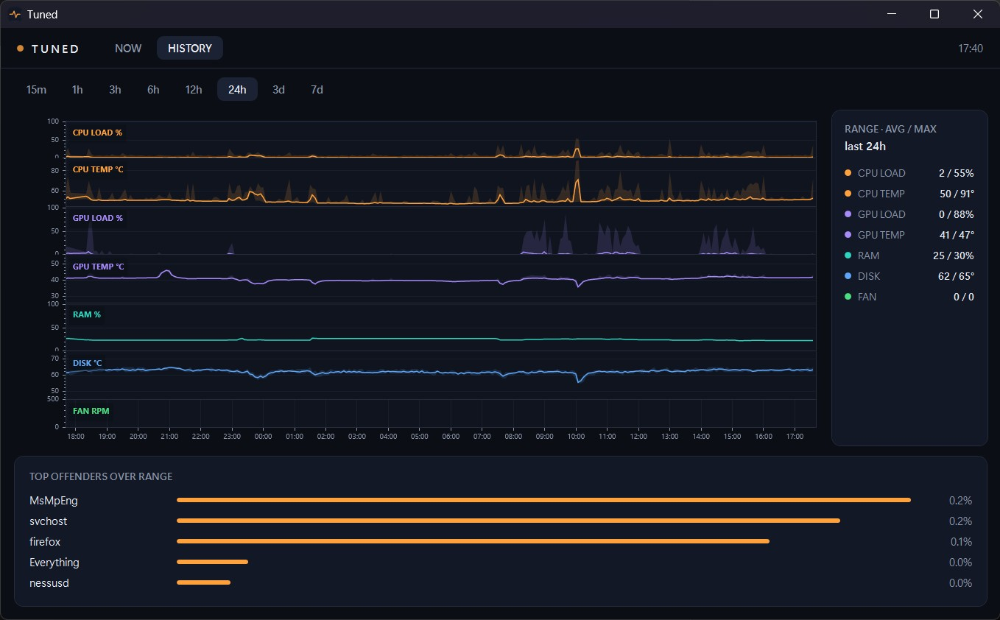

# Tuned

A portable hardware monitor for Windows 11.

I built this for myself. I wanted something that just sat in the tray and answered two
questions, without a lot of ceremony:

- **"Why is the fan going full jet engine?"** Temps, loads and fan RPM, all on one synced timeline.
- **"Why did it feel like I was wading through treacle a few minutes ago?"** CPU, GPU and
  RAM at a glance, plus whichever process was actually hogging the CPU at the time, so you
  don't have to catch it red-handed while it's happening.

Everything else LibreHardwareMonitor knows about is left out, on purpose. One exe, no
installer, no sensor-tree archaeology, no background service you have to remember exists.
It's scoped to what I actually look at day to day, anything new earns its place by making
those two questions faster to answer, it's not there to fill out another chart. If it's
useful to you too, I'd genuinely like to hear about it, and where it falls over.

## Download

**[Download Tuned for Windows 11 (x64)](https://github.com/5AZ/Tuned/releases/latest/download/Tuned.exe)** — one portable `.exe`, no installer. This link always points at the newest release.

Prefer the full package, with licence and third-party notices bundled? Grab the **[latest release zip](https://github.com/5AZ/Tuned/releases/latest)** instead.

## What it shows

| View | Contents |
|---|---|
| **Live** | Hero tiles (CPU load + temp + power, GPU load + temp, RAM, disk temp, fan), per-core heat grid, 90-second sparklines, live top-5 processes |
| **Activity** | Afterburner-style stacked lanes over 15m to 7d with min/max bands, a synced crosshair readout, and "top offenders" for the selected range |

## Getting it running

1. Grab the zip from the [latest release](https://github.com/5AZ/Tuned/releases/latest).
2. Unzip it, put `Tuned.exe` wherever's sensible, no installer, that's the whole install.
3. Run it. It writes its own settings and history file right next to itself, so the exe
   and its folder are fully portable, move the folder and everything moves with it.
4. Approve the single UAC prompt for full sensor access (decline it and Tuned still runs,
   just with a reduced sensor set, a status banner tells you which).
5. Install the **PawnIO driver** from [pawnio.eu](https://pawnio.eu) if prompted, since
   late 2025 LibreHardwareMonitor reads CPU temperature and power through this signed
   driver rather than its predecessor, which Windows 11 now blocks outright.
6. Flip **autostart** in the footer strip once you're happy with it, don't forget that bit,
   it's what turns this into set-and-forget rather than something you relaunch by hand.

## Source

Not public yet. I want to put it through a few more paces first, it'll follow once it's
earned that.

## Changelog

See [CHANGELOG.md](CHANGELOG.md) for what's changed between versions.

## Licence

Free to use and share the unmodified build; see [LICENCE.txt](LICENCE.txt). The
source isn't public yet.

## Third-party notices

Tuned links against the following open-source packages, unmodified, via NuGet:

- **[LibreHardwareMonitorLib](https://github.com/LibreHardwareMonitor/LibreHardwareMonitor)** (MPL-2.0).
  Source for the exact version in use is available at the link above.
- **[ScottPlot](https://scottplot.net)** (MIT)
- **[Microsoft.Data.Sqlite](https://github.com/dotnet/efcore) / SQLitePCLRaw** (MIT / Apache-2.0)
- **[H.NotifyIcon](https://github.com/HavenDV/H.NotifyIcon)** (MIT)

Full license texts are included in the release zip.
